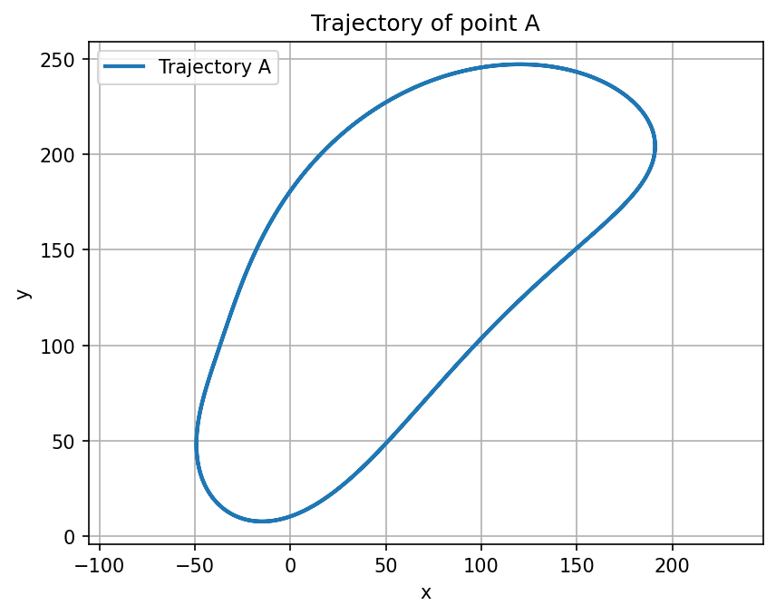
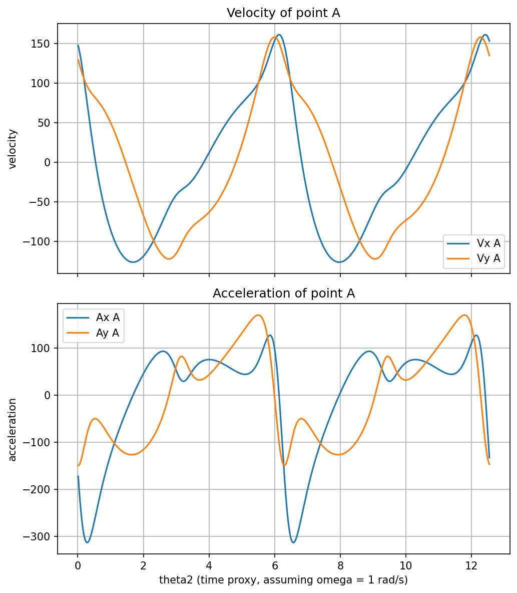

# Bar-Linkage Kinematics

Position, velocity, and acceleration analysis of a 5-bar planar linkage mechanism (two fixed bars,
three moving bars), driven by a constant-angular-velocity crank.



## Problem

A mechanism is built from five vectors `r1..r5`: `r1` and (implicitly) the frame are fixed, `r2` is
the driving crank at angle `θ2`, and `r3`, `r4` are coupler/output bars whose angles `θ3`, `θ4` are
determined by the closed-loop constraint `r2 + r3 = r1 + r4`. Two points of interest are tracked: `A`,
on an arm `r5` attached to the coupler, and `B`, the end of the output bar `r4`.

1. Given a driving angle `θ2`, solve for the dependent angles `θ3`, `θ4`, and the Cartesian positions
   of `A` and `B`.
2. Assuming constant crank angular velocity, compute the velocity and acceleration of `A` and `B` over
   time (numerically, since a closed-form derivative of the position solution is impractical).
3. Compute the area enclosed by point `A`'s closed trajectory over one full crank revolution.

## Method

**Position** (`part1_position_analysis.cpp`): the vector loop equation reduces, via a Weierstrass
(half-angle) substitution, to a quadratic in `tan(θ4/2)`, solved in closed form for `θ4` and then
`θ3`. No iteration needed — this is exact, not approximate.

**Velocity and acceleration** (`part2_velocity_acceleration.cpp`): computed via central finite
differences on the θ2-swept position arrays,
```
v ≈ (x[i+1] - x[i-1]) / (2 Δθ2)          a ≈ (x[i+1] - 2x[i] + x[i-1]) / Δθ2²
```
under the assumption of constant angular velocity ω = 1 rad/s, so θ2 doubles as a time proxy and the
θ2-step used in the sweep is the same Δ used in the finite-difference formulas.

**Enclosed area** (`part3_trajectory_area.cpp`): the shoelace formula applied incrementally to the
sampled closed trajectory of point `A`, i.e. a discrete line-integral (Green's theorem) evaluation of
the polygon area.

## Files

| File | Computes | Output |
|---|---|---|
| `part1_position_analysis.cpp` | θ3, θ4, positions of A and B over one revolution | `data/trajectory_A.csv`, `data/trajectory_B.csv`, `data/theta2_theta3_table.csv` |
| `part2_velocity_acceleration.cpp` | Velocity and acceleration of A and B over two revolutions | `data/velocity_A.csv`, `data/velocity_B.csv`, `data/acceleration_A.csv`, `data/acceleration_B.csv` |
| `part3_trajectory_area.cpp` | Area enclosed by A's trajectory | `data/enclosed_area.csv` |
| `analysis.ipynb` | Plots all of the above | `data/*.png` |

Reference configuration used throughout: `r1=280, r2=140, r3=240, r4=190, r5=150, α=0.6 rad`.

## How to build and run

```
g++ -O2 -std=c++17 -Wall -o part1_position_analysis part1_position_analysis.cpp
./part1_position_analysis
```
(same pattern for the other two files), then open `analysis.ipynb`.

## Example output

Velocity and acceleration of point A over two crank revolutions — smooth, periodic curves in the tens
to low hundreds, matching the expected physical scale:



Enclosed area of point A's trajectory: **31253.42 square units** (reproduced identically by the C++
console output, `data/enclosed_area.csv`, and the notebook).

## Notable fixes / design decisions vs. the original coursework

- **Fixed a real numerical bug**: the finite-difference step constant used in Part 2 (`1e-6`) didn't
  match the actual angular step used in the θ2 sweep (`4π/N ≈ 0.0126` for `N=1000`) — off by about
  four orders of magnitude, which inflated computed velocities by roughly 10⁴× and accelerations by
  roughly 10⁸× (values around 10⁶-10⁹ instead of the expected 10-500). Fixed by deriving the
  finite-difference step from the same `N` used in the sweep loop, so there's a single source of
  truth instead of two constants that have to be kept in sync by hand.
- Part 3 originally only printed its result to the console; it now also writes `data/enclosed_area.csv`
  so the value is reproducible without re-running and reading stdout.
