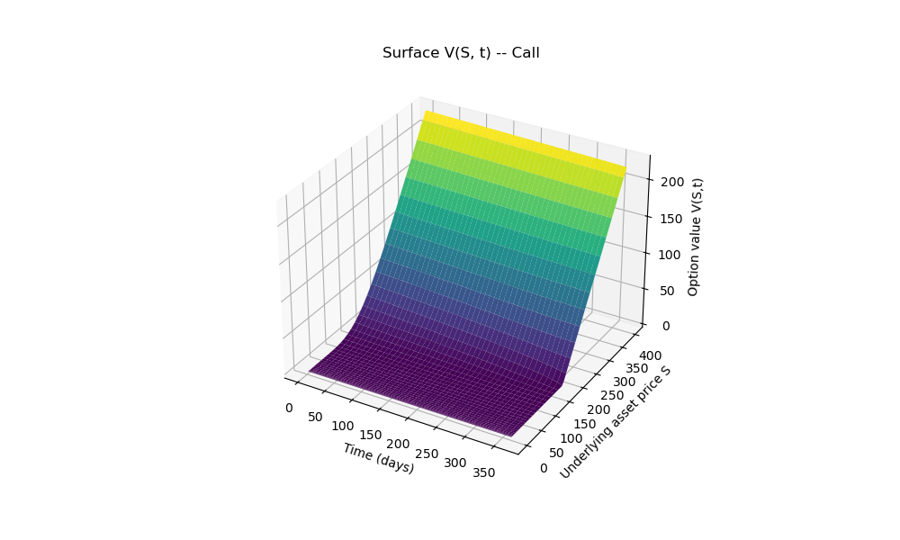
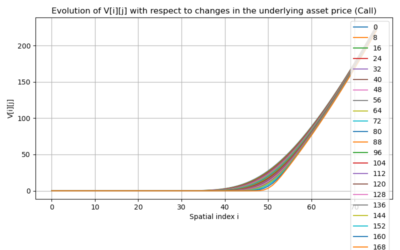
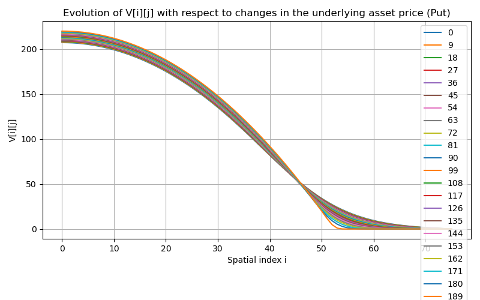
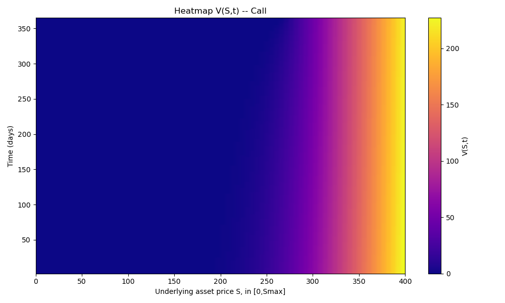
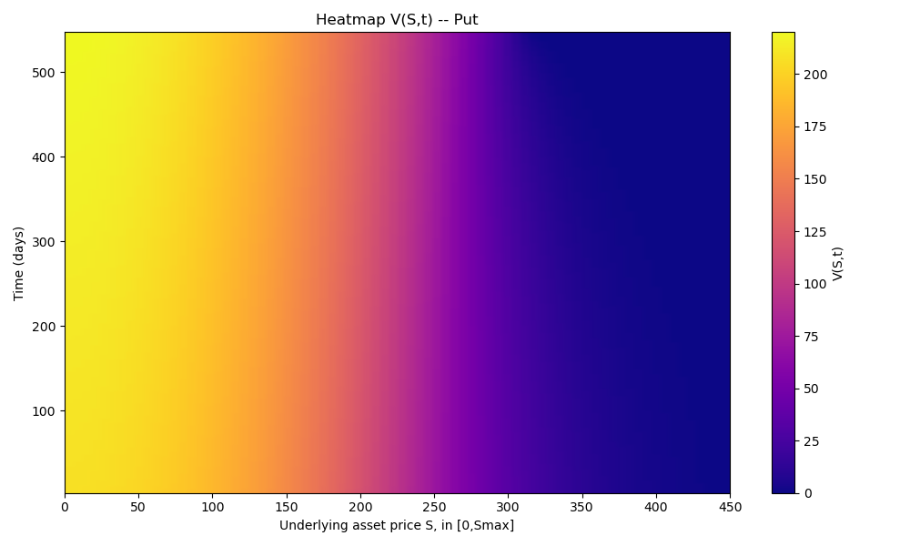
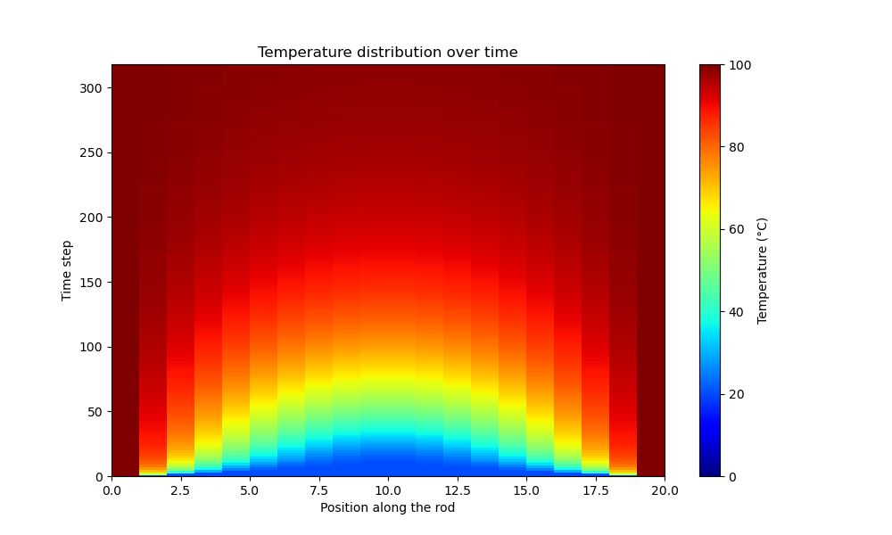

# Finite-Difference PDE Solvers: Black-Scholes & Heat Equation

Two independent finite-difference solvers for parabolic PDEs: option pricing under Black-Scholes
(the headline piece — a non-uniform-grid explicit scheme with a full stability analysis), and a
standard 1D heat-conduction equation.



## `black-scholes/` — Option pricing via finite differences on a non-uniform grid

### Problem

Solve the Black-Scholes PDE for the value `V(S,t)` of a European option,
```
∂V/∂t + ½σ²S²∂²V/∂S² + rS∂V/∂S − rV = 0
```
numerically, given volatility `σ`, risk-free rate `r`, strike `K`, and time to maturity `T`.

### Method

Substituting `τ = T − t` turns this into a forward-in-τ parabolic PDE, so the terminal payoff at
maturity becomes the numerical scheme's initial condition. The spatial derivatives are discretized
with an **explicit finite-difference scheme on a non-uniform grid**,
```
S_i = S_max · (i/N)²,   i = 0..N
```
a quadratic grading that concentrates nodes near `S=0`, where option value is most sensitive to price
changes. Central differences on this non-uniform spacing give
```
V_i^{j-1} = a·V_{i-1}^j + b·V_i^j + c·V_{i+1}^j
```
for explicit coefficients `a, b, c` derived from the local mesh spacing. Because the scheme is
explicit, the timestep is bounded by a stability condition,
```
Δτ < h_{i-1} h_i / (r h_{i-1} h_i + σ² x_i²)
```
computed at every interior node; the program takes the minimum over the whole grid as the largest
safe `Δτ`, and picks the number of time steps accordingly — no oscillation or blow-up, by
construction.

**Boundary and terminal conditions** are payoff-dependent and were derived (not just assumed) by
taking the S→0 limit of the PDE itself, which reduces to `dV/dτ = -rV` and integrates directly to
`V(0,t) = K e^{-r(T-t)}` for a put. The program supports both option types, matched consistently:

| | Terminal payoff | `V(0,t)` | `V(S_max,t)` |
|---|---|---|---|
| Call | `max(S-K, 0)` | `0` | `S_max - K e^{-r(T-t)}` |
| Put | `max(K-S, 0)` | `K e^{-r(T-t)}` | `0` |

### How to build and run

```
g++ -O2 -std=c++17 -Wall -o black_scholes_fd black_scholes_fd.cpp
./black_scholes_fd
```
Prompts interactively for volatility, risk-free rate, time to maturity, option type (C/P), strike, and
`S_max`. Two example runs are committed in `data/`: a call (σ=0.35, r=0.04, T=1.0, K=180, S_max=400)
and a put (σ=0.30, r=0.04, T=1.5, K=220, S_max=450).

### Example output

Discrete-mesh evolution, 3D value surface, and a price/time heatmap for both option types:

| Call | Put |
|---|---|
|  |  |
|  |  |

The call/put selector sets the payoff *and* both boundary conditions together, consistently. Verified
against the closed-form boundary formulas directly from the output CSVs: computed `V(S_max,t)` for the
call run and `V(0,t)` for the put run both matched `Ke^{-r(T-t)}`/`S_max-Ke^{-r(T-t)}` to 4 decimal
places at every sampled time step.

---

## `heat-equation/` — 1D transient heat conduction

### Problem

A rod of length `L=50mm`, initially at a uniform 20°C, has both ends suddenly clamped to 100°C.
Compute the temperature profile `u(x,t)` over time.

### Method

Standard **explicit FTCS (Forward-Time, Central-Space) finite-difference scheme** for the 1D
diffusion equation `∂u/∂t = α ∂²u/∂x²`, with the timestep set from the von Neumann stability limit for
explicit diffusion, `Δt = 0.5 Δx²/α` — guaranteeing a non-oscillating, non-diverging solution.

### How to build and run

```
g++ -O2 -std=c++17 -Wall -o heat_equation_fd heat_equation_fd.cpp
./heat_equation_fd
```

### Example output



The interior smoothly relaxes from 20°C toward the 100°C boundary values, with no instability.
