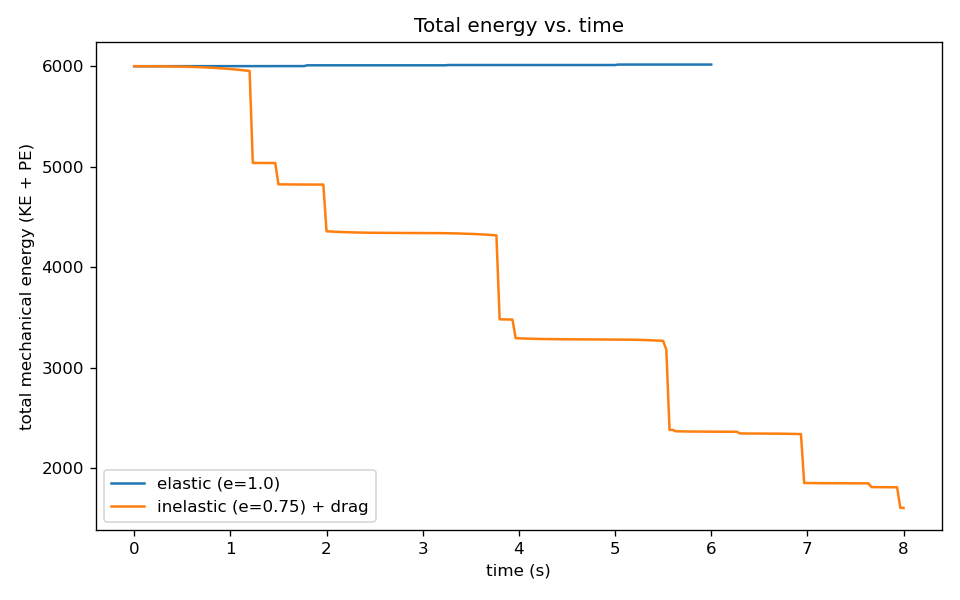
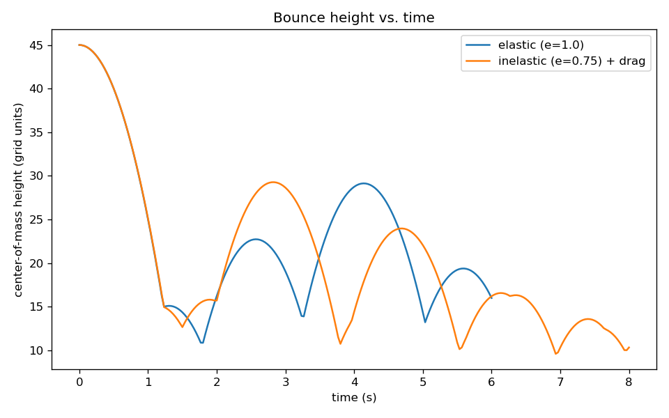

# Irregular Rigid-Body Collision (2D)

A small 2D physics engine: an arbitrary irregular shape, defined by an ASCII grid, falls under
gravity and bounces off a flat ground plane, exchanging energy between translational and rotational
motion on every impact — the same phenomenon that makes a thrown book tumble instead of sliding.


## Problem

Represent a rigid, irregularly-shaped 2D object as a set of equal point masses on a grid (rather than
as a simple circle or polygon with known formulas for mass and inertia), and simulate it falling and
bouncing off the ground:

1. Load the shape, compute its center of mass and moment of inertia by discretizing it into point
   masses, and evolve its position and orientation over time given an initial linear and angular
   velocity.
2. Detect when the shape touches the ground, and resolve the collision so that linear momentum along
   the ground normal, angular momentum, and total mechanical energy are all handled consistently —
   an off-center impact should visibly transfer some of the fall's kinetic energy into spin.
3. Render each simulation frame to an image and assemble the frames into a video.
4. Extend the model to inelastic collisions and air resistance, so energy dissipates and the bounces
   decay, as a real object would.
5. (Discussion, no code required) How would this generalize to two or more objects colliding with
   each other instead of one object and a flat plane?

## Method

**Mass properties.** The shape is loaded from a plain-text grid (`shape.txt`, any non-`0` character
counts as filled). Center of mass and moment of inertia are computed by discretizing the shape into
equal point masses on the grid:

```
r_cm = (Σ m_i r_i) / M_total          I = Σ m_i |r_i - r_cm|²
```

Only the outline ("shell") of the shape is kept and moved each frame — a filled cell counts as an
outline point if any of its 8 neighbors (including cells just outside the grid) is empty.

**Motion between collisions.** With no contact forces, the body is a free rigid body: its center of
mass follows projectile motion, and it rotates at constant angular velocity, both under standard
2D-rotation-matrix kinematics applied about the center of mass. A separate `stepWithDrag` variant
(used only for the Part 4 run) adds a linear air-drag term to both axes.

**Collision response.** On contact, this reduces to a textbook impulsive rigid-body collision. Let
`rx` be the horizontal offset of the contact point from the center of mass (the moment arm for a
purely vertical/normal impulse), `M` the mass, `I` the moment of inertia, and `v_c = v_y + ω·rx` the
vertical velocity of the material point touching the ground. A normal impulse `J` that reverses the
contact point's velocity with restitution `e` is:

```
J = -(1 + e) v_c / (1/M + rx²/I)        Δv_y = J/M        Δω = J·rx/I
```

`Δω = J·rx/I` is exactly the impulse–angular-momentum relation for a normal impulse, and requiring
`v_c` to reverse with restitution `e` is algebraically equivalent to the energy-conservation condition
when `e = 1` (perfectly elastic). This is a closed-form solution — no root-
finding or iteration needed — and it generalizes directly to Part 4 by simply lowering `e` below 1.
Horizontal velocity is left unchanged (frictionless normal contact); after the impulse, any residual
penetration into the ground is corrected by translating the body back out.

**Units.** Gravity, the ground height, and drag are expressed in the same "grid units" as the input
shape — this is a deliberate visualization/pacing choice, not a claim of SI-realistic scale. Pixels
only enter the picture at render time, via a single `SCALE_PX` constant.

**Physics substepping.** At the fall speeds involved (tens of grid-units/second), a single physics
step per rendered frame let the shape overshoot noticeably past the ground plane before the collision
was caught, which measurably injected energy into the (supposedly energy-conserving) elastic run.
Each rendered frame now advances the physics in 48 smaller substeps, which reduces that overshoot
enough that the elastic run's energy drift drops to well under 1% (see Verification below).

**Part 5 — extending to two (or more) objects.** The single-plane collision here reduces cleanly to a
single contact point with a fixed, always-vertical normal direction. Two irregular bodies colliding
with each other is the same math with two changes: (a) detection becomes contour-vs-contour instead
of contour-vs-plane — each frame, find the closest pair of points between the two objects' outlines
and treat that as the contact if the distance is below a threshold; (b) the contact normal is no
longer fixed as "straight up" but estimated locally from the two nearest contour points (e.g. the
direction between the two closest points, or a locally-fitted line), and both objects receive equal-
and-opposite impulses along that normal, each producing its own `Δv`/`Δω` scaled by its own mass and
moment of inertia (a direct generalization of `Δv_y = J/M`, `Δω = J·rx/I` to a floating normal
direction instead of the fixed vertical one used here). The simplifying assumption that makes this
tractable is treating the contact region as locally flat — reasonable as long as the two shapes are
large relative to their surface curvature at the point of contact, which breaks down for very sharp
or spiky geometry. For `n` objects, the same pairwise contact logic applies to every pair in contact
during a given frame, processed one impulse at a time within the frame (a standard, if approximate,
way to keep an n-body contact scenario numerically simple).

## Files

| File | Purpose |
|---|---|
| `rigid_body_collision.cpp` | The physics engine: mass properties, motion, collision detection + response, BMP frame export |
| `libbmp.h` / `libbmp.cpp` | Third-party BMP read/write library (Marc Volker Dickmann, 2016-2017), used unmodified |
| `shape.txt` | The example shape: a "flag on a pole" silhouette, chosen because its center of mass sits far from its bounding-box center, so off-center impacts produce clearly visible rotation |
| `analysis.ipynb` | Loads the energy/angular-velocity logs and plots the diagnostics below |
| `data/energy_elastic.csv`, `data/energy_inelastic.csv` | Per-frame kinetic/potential/total energy, angular velocity, and center-of-mass height for each run |
| `assets/elastic_collision.gif`, `assets/inelastic_collision.gif` (+ `.mp4`) | Rendered demo clips |

## How to build and run

```
g++ -O2 -std=c++17 -Wall -o rigid_body_collision rigid_body_collision.cpp libbmp.cpp
./rigid_body_collision
```

This writes ~420 BMP frames into `frames/` (gitignored — regenerate locally) and the energy logs into
`data/`. To assemble a run into a video/GIF:

```
ffmpeg -framerate 30 -i frames/elastic_frame_%05d.bmp -c:v libx264 -pix_fmt yuv420p assets/elastic_collision.mp4
ffmpeg -i assets/elastic_collision.mp4 -vf "fps=15,scale=480:-1:flags=lanczos" assets/elastic_collision.gif
```
(swap `elastic` for `inelastic` for the Part 4 run.)

## Example output

**Total mechanical energy.** The elastic run (`e=1.0`) stays essentially flat across 6 seconds and
5 bounces; the inelastic + drag run (`e=0.75`) loses energy in a visible staircase, one step per
bounce, plus a small continuous decline from drag between bounces:



**Bounce height.** Interestingly, even in the elastic run — where *total* mechanical energy is
exactly conserved — the peak bounce height decreases over time. This isn't a bug: each off-center
impact converts some translational kinetic energy into rotational spin, and spin doesn't contribute
to how high the center of mass bounces, even though it's still part of the conserved total energy.
That's the key physical result, visible directly in the data:


