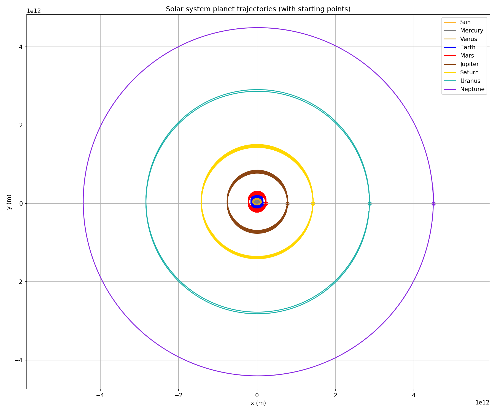

# N-Body Solar System Simulation

A Newtonian gravity simulator built up in three stages: two bodies, then three (Sun-Earth-Moon), then
a full nine-body solar system, all integrated with the Velocity Verlet method.



## Problem

Simulate gravitationally interacting bodies under Newton's law `F = -G m1 m2 / r² r̂`, in three parts
of increasing complexity:

1. **Two bodies**: simulate one body orbiting another, and examine how the trajectory (bound ellipse,
   collision, or escape) depends on the mass ratio between them — including the real Sun-Earth mass
   ratio (~332,946:1).
2. **Three bodies**: extend to pairwise-summed forces for a Sun-Earth-Moon system, using the real
   Earth-Moon mass ratio (~81.3:1) and realistic orbital distances, and examine the same
   trajectory/collision/escape questions.
3. **N bodies**: generalize to an arbitrary number of mutually interacting bodies, and simulate a full
   solar system (at least four planets).

## Method

Each body carries a position, velocity, and acceleration; every pair of bodies contributes a
gravitational force term, summed to get each body's total acceleration. Integration uses **Velocity
Verlet**, a symplectic (energy-conserving over long runs) second-order integrator:

```
r(t+dt) = r(t) + v(t) dt + ½ a(t) dt²
v(t+dt) = v(t) + ½ (a(t) + a(t+dt)) dt
```

The key detail is the velocity update: it uses the *average* of the acceleration before and after the
position update, which requires recomputing every body's acceleration at its new position before
touching any velocity. This is what makes Verlet symplectic — a naive `v += a*dt` using only the old
acceleration (semi-implicit/symplectic Euler) still looks plausible over a short run, but drifts in
total energy over long ones.

**Two-body trajectory classification** follows directly from the sign of total mechanical energy
`E = KE + PE`: `E < 0` gives a bound elliptical orbit, `E = 0` a parabolic escape trajectory, `E > 0` a
hyperbolic (unbound) trajectory. A collision occurs if the bodies' closest approach is smaller than
the sum of their radii; escape occurs when the relative speed at a given separation exceeds the local
escape velocity `v_esc = sqrt(2 G (m1+m2)/r)`. The lighter the second body (large mass ratio), the
closer its orbit resembles a fixed-focus ellipse around an effectively stationary primary; as the mass
ratio approaches 1, both bodies orbit their mutual barycenter with comparable excursions.

## Files

| File | Simulates | Output |
|---|---|---|
| `part1_two_body.cpp` | Two bodies, three mass ratios (0.5, 1.0, 2.0) | `data/two_body_mass_ratio_{low,equal,high}.csv` |
| `part1_sun_earth_exact_ratio.cpp` | Sun-Earth, exact mass ratio 332,946:1 | `data/sun_earth.csv` |
| `part2_three_body_earth_moon.cpp` | Sun-Earth-Moon, Earth-Moon ratio 81.3:1 | `data/sun_earth_moon.csv` |
| `part3_full_solar_system.cpp` | Sun + 8 planets, real masses/orbital radii, circular coplanar initial conditions | `data/solar_system.csv` |
| `analysis.ipynb` | Plots all four datasets | `data/*.png` |

The full solar-system run uses a 2-day timestep over 165 years — long enough for every planet,
including Neptune, to complete at least one full orbit.

## How to build and run

```
g++ -O2 -std=c++17 -Wall -o part1_two_body part1_two_body.cpp
./part1_two_body
```
(same pattern for the other three `.cpp` files), then open `analysis.ipynb`.

## Example output

Two-body orbits for three mass ratios, and the full nine-body solar system (shown above) both trace
clean, closed periodic orbits — the visual signature of a correctly energy-conserving integrator.

## Notable fixes / design decisions vs. the original coursework

- **Fixed a real bug**: the assignment specifies Velocity Verlet (position with the old acceleration,
  velocity with the *average* of old and new), but the original code updated velocity using only the
  old acceleration in every one of the four programs — plain symplectic Euler, not true Velocity
  Verlet. Fixed identically across all four files by recomputing acceleration at the new position
  before updating velocity.
- **Verified the fix numerically**: for the equal-mass two-body run, total mechanical energy at the
  start and end of the simulation now agrees to about 1 part in 10¹⁰ (essentially floating-point
  precision) — the expected signature of a correctly implemented symplectic integrator.
- The original solar-system run had a comment claiming a "100-year" simulation that didn't match the
  actual computed duration; the corrected version explicitly runs for 165 years (Neptune's orbital
  period) so every planet visibly completes at least one full orbit.
- No written answers to the assignment's conceptual questions (trajectory classification vs. mass
  ratio, collision/escape conditions) existed anywhere in the original project — the summary above is
  new, grounded in what the corrected simulations actually show.
