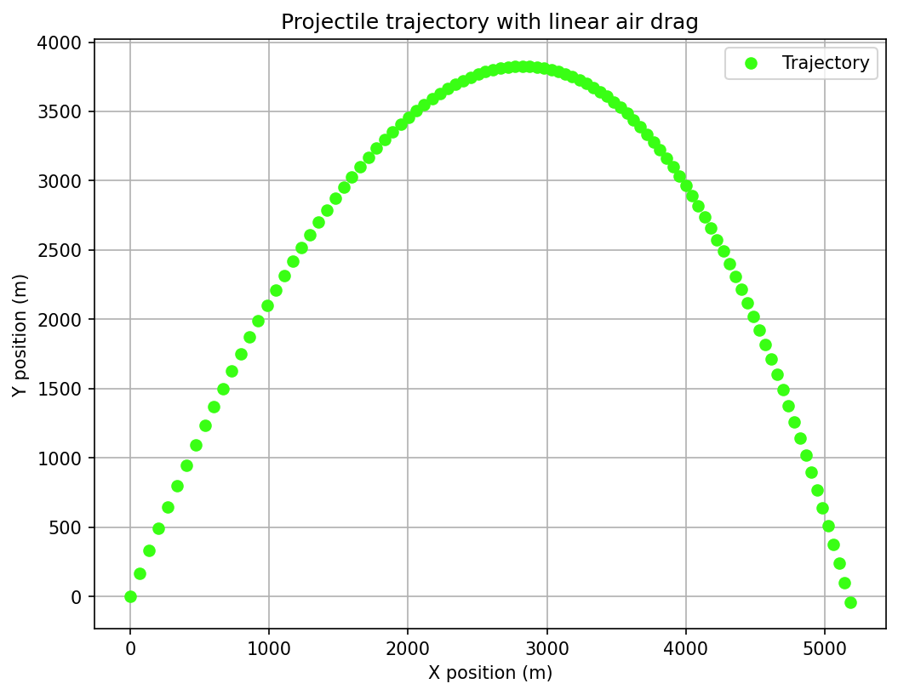
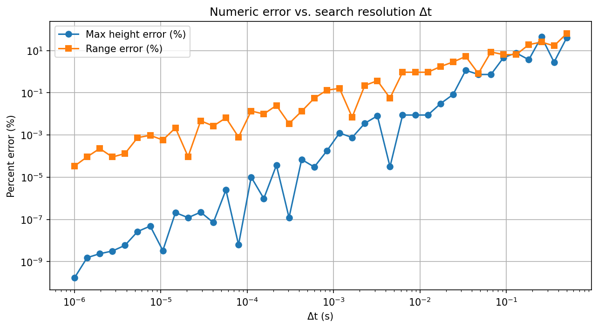

# Projectile Motion With and Without Air Drag

Three progressively harder projectile-motion problems: numerical-vs-analytic error analysis for
frictionless motion, trajectory simulation with linear air drag, and a two-projectile interception
search.



## Problem

1. **No drag**: using the standard kinematic equations, numerically estimate a projectile's maximum
   height and range by brute-force time-stepping, compare against the closed-form analytic values,
   and study how the percent error shrinks as the timestep `Δt` shrinks (from 1e-6 s up to 0.5 s).
2. **Linear drag**: derive and implement a semi-analytic per-step update for motion under linear air
   drag (`F_drag = -bv`), and simulate a specific example trajectory.
3. **Interception**: an attacker fires a drag-affected projectile from `x=0` toward a base centered at
   `x=5250` m; a defender at `x=6500` m fires back (mirrored) to intercept it as far from the base as
   possible, by searching over firing angle (1° resolution) and delay time. Do this for 10 given
   attacker configurations.

## Method

**Part 1** uses the closed-form kinematics `h_max = V²sin²θ/2g`, `R = V²sin(2θ)/g` as ground truth,
and a simple brute-force stepper (find the time step where vertical velocity/height crosses zero) as
the numerical estimate — then repeats that comparison across a log-spaced sweep of `Δt` values to show
convergence.

**Part 2** uses the exact per-step solution of the linear-drag ODE (not a generic Euler/RK4
integrator) — a closed-form update for position and velocity given `b`, `m`, and `Δt`.

**Part 3** is a brute-force 2D search (defender angle × delay time) with an adaptive timestep that
shrinks when the two projectiles are close, looking for a closest approach under 1 m — a grid search,
not an optimizer, matching the assignment's suggested approach.

## Files

| File | Computes | Output |
|---|---|---|
| `part1_no_drag.cpp` | hmax/range error vs. Δt, one example trajectory | `data/error.csv`, `data/trayectoria.csv` |
| `part2_linear_drag.cpp` | Trajectory under linear drag (V=324 m/s, θ=68.1°, b=0.05, m=5 kg) | `data/trajectory_drag.csv` |
| `part3_interception.cpp` | Best defender angle/delay/distance-from-base for 10 attacker configs | `data/interception_results.csv` |
| `analysis.ipynb` | Plots all three | `data/*.png` |

## How to build and run

```
g++ -O2 -std=c++17 -Wall -o part1_no_drag part1_no_drag.cpp
./part1_no_drag
```
(same pattern for the other two files — note Part 3's brute-force search over 10 cases takes several
minutes to run), then open `analysis.ipynb`.

## Example output

Percent error between the numeric and analytic estimates shrinks steadily as `Δt` shrinks, down to
effectively zero (~1e-10%) at the finest resolution tested — the expected signature of a convergent
numerical method:



Of the 10 interception cases, 9 find a valid interception with a physically sensible angle, delay, and
distance from the base; one case (a fast, flat, nearly grazing shot at 2° elevation) has no solution
under the 1-meter tolerance within the search bounds — a legitimate outcome, not a bug, since a very
flat shot doesn't leave the defender's projectile enough time or airspace to close the gap.

## Notable fixes / design decisions vs. the original coursework

- **Fixed a missing output**: Part 1's percent-error-vs-Δt sweep, needed for the assignment's log-log
  plot, was never actually computed — the original code only evaluated error at one fixed `Δt` and the
  notebook had a dead cell trying to read a `error.csv` that didn't exist. Added the sweep.
- **Fixed a workflow gap**: Part 3 originally required re-running the program interactively for each of
  the 10 attacker configurations and reported raw collision coordinates. It now loops over all 10 cases
  from the assignment's table internally and reports distance from the base directly.
