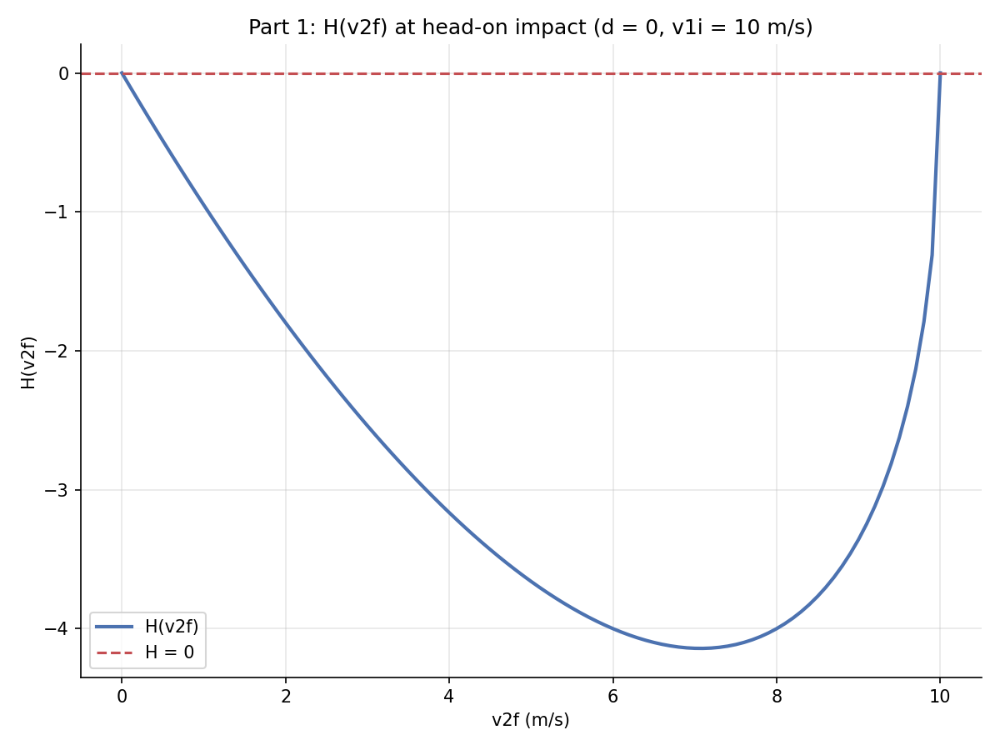
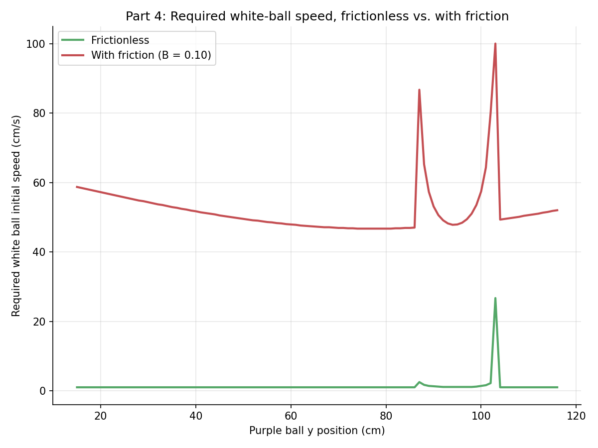
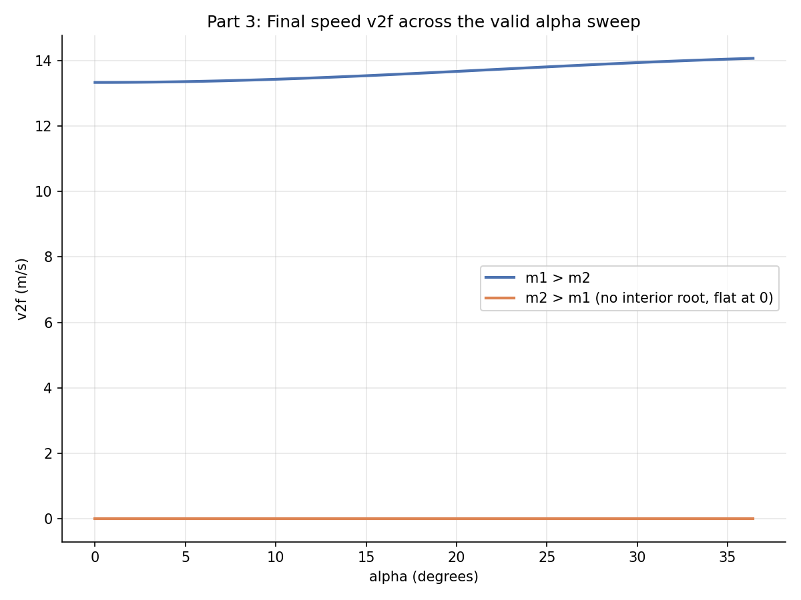

# Elastic Sphere/Circle Collisions

Root-finding applied to 2D elastic collisions: momentum and energy conservation reduce to a single
nonlinear equation in the post-collision velocity, solved by bisection, across four progressively more
general scenarios.



## Problem

A sphere of radius `r1` moving at `v1` strikes a second sphere of radius `r2`, offset vertically by
`d`, in a fully elastic collision.

1. **Equal masses, head-on offset**: reduce conservation of momentum and kinetic energy, plus the
   geometric relation `sinθ = d/(r1+r2)`, to a single equation `H(v2f)=0` and solve it numerically.
2. **Unequal masses**: rederive the same equation with `m1 ≠ m2`.
3. **Oblique incidence**: add an incidence angle `α` between the spheres, rederive again, and find the
   physically valid range of `α`.
4. **Pool-table scenario**: a white ball must strike a purple ball (positioned along a line) which
   strikes a red ball into a target corner — find the minimum white-ball speed required, with and
   without table friction.

## Method

Parts 1-3 all reduce to a **root-finding problem**: momentum + energy conservation give a closed
system that collapses to one equation `H(v2f)=0` in the single unknown `v2f` (the second sphere's
post-collision speed), solved by **bisection**. The interesting numerical-methods content is getting
the bisection *bracket* right — `H` is only real-valued (via an `asin` term) on a finite domain, and a
bracket that extends past that domain returns NaN, which silently defeats the usual `f(a)·f(b)<0`
sign-change check. The bracket used here is derived analytically around the closed-form root rather
than guessed, which is what makes the search reliable without needing an ad-hoc monotonicity clamp on
the output.

Part 4 combines the same collision math with **explicit stepping under linear friction** to decay each
ball's speed as it travels, then a **brute-force outer search** over the white ball's initial speed to
find the minimum that still delivers the red ball into the target corner at ≥1 cm/s.

## Files

| File | Solves | Output |
|---|---|---|
| `part1_equal_mass.cpp` | Equal-mass H(v2f) curve, %v2f vs. offset d | `data/H_curve.csv`, `data/v2f_vs_offset.csv` |
| `part2_unequal_mass.cpp` | H(v2f) for m1>m2 and m2>m1 | `data/m1_greater_H.csv`, `data/m2_greater_H.csv` |
| `part3_oblique_angle.cpp` | H(v2f) swept over the valid range of incidence angle α | `data/m1_greater_alpha.csv`, `data/m2_greater_alpha.csv` |
| `part4_pool_table.cpp` | Minimum white-ball speed, with/without friction | `data/results_frictionless.csv`, `data/results_with_friction.csv` |
| `analysis.ipynb` | Plots all of the above | `data/*.png` |

## How to build and run

```
g++ -O2 -std=c++17 -Wall -o part1_equal_mass part1_equal_mass.cpp
./part1_equal_mass
```
(same pattern for the other three files), then open `analysis.ipynb`.

## Example output

The frictionless pool-table run requires a lower and flatter range of white-ball speeds (1-26.7 cm/s)
than the run with table friction (46.7-100 cm/s), exactly as expected:



Part 3's valid range of incidence angle α was derived from the grazing-contact geometry
(`α_max = asin((r1+r2)/D) ≈ 36.9°` for this setup) rather than sampled at one arbitrary angle:


